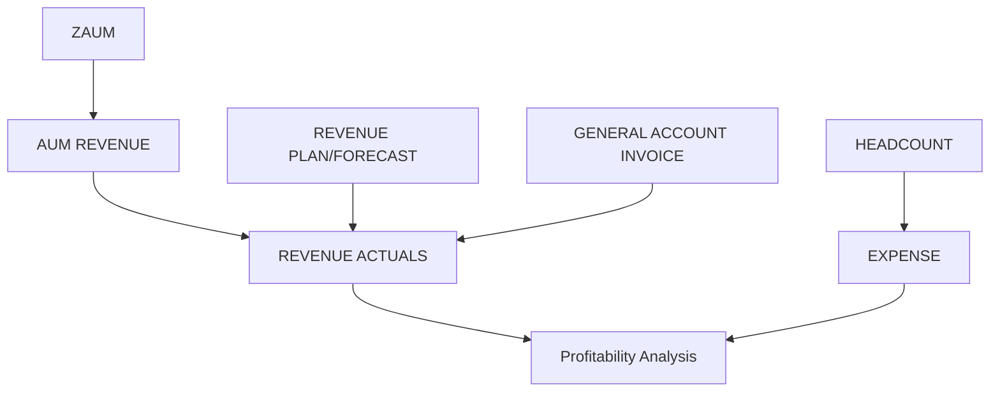

# Understanding Investment Management Database Tables
## A Beginner's Guide to Investment Management Data

---

## Table of Contents
1. [Introduction to Investment Management](#introduction)
2. [Table 1: HEADCOUNT](#headcount)
3. [Table 2: AUM REVENUE](#aum-revenue)
4. [Table 3: REVENUE PLAN/FORECAST](#revenue-plan-forecast)
5. [Table 4: REVENUE ACTUALS](#revenue-actuals)
6. [Table 5: EXPENSE](#expense)
7. [Table 6: ZAUM](#zaum)
8. [Table 7: GENERAL ACCOUNT INVOICE](#general-account-invoice)
9. [How All Tables Work Together](#integration)
10. [Real-World Meeting Scenario](#scenario)
11. [Key Takeaways](#takeaways)

---

## Introduction to Investment Management {#introduction}

### What is Investment Management?

Think of an Investment Management company like a **professional money manager** - similar to how you might hire someone to manage your home, but instead they manage money for clients.

### The Basic Business Model

1. **Clients give the company money** to invest (like putting money in a savings account, but more sophisticated)
2. **The company invests that money** in stocks, bonds, mutual funds, etc.
3. **The company charges a fee** for managing that money (usually a small percentage per year)
4. **The company has costs** to run the business (employees, technology, offices, etc.)
5. **Profit = Fees collected - Costs**

---

## Table 1: HEADCOUNT {#headcount}
### "How many employees do we have?"

**Simple Analogy:** Like counting how many people work at a restaurant

### What it Tracks

- How many people work in each department
- Whether it's the **plan** (how many we want to hire), **forecast** (updated prediction), or **actual** (how many we really have)

### Real Example

```
Department: Investment Operations
Plan: 50 employees for Q1 2025
Forecast: 48 employees (adjusted down slightly)
Actual: 47 employees (reality - 3 positions still open)
```

### Why it Matters

- Salaries are usually the biggest expense
- More employees = higher costs
- Need to plan hiring to support business growth

### Schema

```sql
CREATE TABLE headcount (
    cc_period_id      VARCHAR(200) NOT NULL,  -- Composite: cost_center + period
    version_name      VARCHAR(100),           -- Plan/Forecast/Actual
    l4_cost_center    VARCHAR(500),           -- Department/team
    time1             DATE NOT NULL,
    data_source2      VARCHAR(100),
    time2             INT NOT NULL,            -- Period in YYYYMM format
    headcount         INT,                     -- Number of employees
    last_updated      TIMESTAMP,
    PRIMARY KEY (cc_period_id)
);
```

### Simple Question it Answers

> "How many people do we need to hire in the Technology department next quarter?"

---

## Table 2: AUM REVENUE {#aum-revenue}
### "How much money are we managing and earning?"

**Simple Analogy:** Like a parking garage that charges based on how many cars are parked

### Key Terms Explained

#### AUM = Assets Under Management
- This is the **total amount of client money** the company is managing
- Example: If 100 clients each give the company $1 million = $100 million AUM

#### Fee-Paying AUM
- Money that actually generates fees
- Example: Client has $10 million with the company, but only $8 million is in fee-paying accounts
- Fee-Paying AUM = $8 million

#### Revenue
- The fees the company earns
- Example: The company charges 0.50% per year to manage money
- $8 million × 0.50% = $40,000 in annual revenue from that client

### Real Example

```
Fund Name: "Growth Stock Fund"
Fee-Paying AUM: $500 million
Management Fee: 0.75% per year
Revenue: $500M × 0.75% = $3.75 million per year
```

### What the Columns Mean

- **Advisor:** The salesperson/relationship manager who brought in the client
- **Fund Family:** Group of related investment products (like "Equity Funds")
- **Fund Name:** Specific product (like "Large Cap Growth Fund")
- **Share Class:** Different fee structures for same fund
  - Example: Class A (higher fee, sold through advisors), Class I (lower fee, institutional clients)

### Schema

```sql
CREATE TABLE aum_revenue (
    data_index                    VARCHAR(70) NOT NULL,
    version_name                  VARCHAR(256),
    advisor                       VARCHAR(256),
    fund_family                   VARCHAR(256),
    fund_name                     VARCHAR(256),
    share_class                   VARCHAR(256),
    time1                         DATE,
    fee_paying_aum                NUMERIC(18,2),
    reportable_aum                NUMERIC(18,2),
    revenue                       NUMERIC(18,2),
    expense_aum_revenue_key       VARCHAR(256),
    period_month                  INTEGER,
    period_year                   INTEGER,
    time2                         INTEGER,
    data_source2                  VARCHAR(256),
    last_updated                  TIMESTAMP,
    PRIMARY KEY (data_index, time2)
);
```

### Simple Question it Answers

> "How much money did we earn in December from managing the ABC Growth Fund?"

---

## Table 3: REVENUE PLAN/FORECAST {#revenue-plan-forecast}
### "How much money do we EXPECT to earn?"

**Simple Analogy:** Like budgeting your personal income for next year

### The Difference Between PLAN and FORECAST

#### PLAN
- Created once a year (usually in December for next year)
- The "official budget" or target
- Example: "We plan to earn $100 million in 2025"

#### FORECAST
- Updated throughout the year (monthly or quarterly)
- Adjusted based on current trends
- Example: "It's June, and we now forecast $95 million for the year"

### Real Example

```
January 2025:
- PLAN: Expect $10 million AUM to grow to $11 million by year-end
- Revenue Plan: $10.5M × 0.75% = $78,750

June 2025 Update:
- FORECAST: Actually looks like we'll reach $10.8 million AUM
- Revenue Forecast: $10.8M × 0.75% = $81,000
```

### Why Have Both?

- **PLAN** = Original goal (doesn't change)
- **FORECAST** = Updated expectation (changes based on reality)
- **ACTUAL** = What really happened

This lets managers say: "We're doing better/worse than plan, and here's why"

### Schema

```sql
CREATE TABLE revenue_plan_forecast (
    data_index                    VARCHAR(70) NOT NULL,
    version_name                  VARCHAR(256),
    fund_name                     VARCHAR(256),
    share_class                   VARCHAR(256),
    dc_tier1                      VARCHAR(256),  -- Distribution channel tier 1
    dc_tier2                      VARCHAR(256),
    dc_tier3                      VARCHAR(256),
    dc_tier4                      VARCHAR(256),
    data_source                   VARCHAR(256),
    reporting_currency            VARCHAR(256),
    assets_under_administration   VARCHAR(256),
    time1                         DATE,
    fee_paying_aum                NUMERIC(18,2),
    reportable_aum                NUMERIC(18,2),
    revenue                       NUMERIC(18,2),
    expense_aum_revenue_key       VARCHAR(256),
    period_month                  INTEGER,
    period_year                   INTEGER,
    time2                         INTEGER,
    data_source2                  VARCHAR(256),
    last_updated                  TIMESTAMP,
    PRIMARY KEY (data_index, time2)
);
```

### Simple Question it Answers

> "Based on current market trends, how much revenue should we expect in Q3 2025?"

---

## Table 4: REVENUE ACTUALS {#revenue-actuals}
### "How much money did we ACTUALLY earn?"

**Simple Analogy:** Like checking your bank statement to see what you actually got paid

### What it Tracks

- The **real, actual fees** that were collected
- Compares to what was planned and forecasted

### Real Example

```
December 2024:
- PLAN: Expected to earn $500,000
- FORECAST: Updated to $480,000
- ACTUAL: Really earned $475,000

Variance Analysis:
- $25,000 below plan (bad news)
- $5,000 below forecast (close, but still missed)
- WHY? Client withdrew $5 million in November (unexpected)
```

### Schema

```sql
CREATE TABLE revenue_actuals (
    data_index           VARCHAR(70) NOT NULL,
    version_name         VARCHAR(256),
    time1                DATE,
    revenue              NUMERIC(18,2),
    period_month         INTEGER,
    period_year          INTEGER,
    time2                INTEGER,
    data_source2         VARCHAR(256),
    last_updated         TIMESTAMP,
    PRIMARY KEY (data_index, time2)
);
```

### Simple Question it Answers

> "Did we hit our revenue targets last month? If not, why not?"

---

## Table 5: EXPENSE {#expense}
### "How much does it cost to run the business?"

**Simple Analogy:** Like tracking all the bills for your household

### What it Tracks

- Salaries for employees
- Technology costs (computers, software)
- Office rent
- Marketing costs
- Everything needed to operate

### Cost Center Hierarchy (L1-L4)

Think of it like organizing expenses by detail level:

```
L1: Company (Investment Management) - Highest level
L2: Division (Investment Operations)
L3: Department (Trading Desk)
L4: Team (Equity Traders) - Most detailed level
```

### Real Hierarchy Example

```
L1: Investment Management
  ├─ L2: Investment Operations
  │   ├─ L3: Trading Desk
  │   │   ├─ L4: Equity Traders ($500,000/year)
  │   │   └─ L4: Fixed Income Traders ($450,000/year)
  │   └─ L3: Portfolio Management
  │       └─ L4: Research Analysts ($800,000/year)
```

### Expense Categories

- **Personnel:** Salaries, bonuses, benefits
- **Technology:** Bloomberg terminals, trading systems
- **Occupancy:** Office rent, utilities
- **Professional Services:** Lawyers, consultants

### Real Example

```
Cost Center: Technology Department
Plan Expense: $2 million for 2025
Actual Expense (Q1): $600,000
Status: On track ($2M ÷ 4 quarters = $500K per quarter)
```

### Schema

```sql
CREATE TABLE expense (
    data_index           VARCHAR(70) NOT NULL,
    version_name         VARCHAR(256),
    l1_cost_center       VARCHAR(500),
    l2_cost_center       VARCHAR(500),
    l3_cost_center       VARCHAR(500),
    l4_cost_center       VARCHAR(500),
    time1                DATE,
    expense_amount       NUMERIC(18,2),
    time2                INTEGER,
    period_month         INTEGER,
    period_year          INTEGER,
    data_source2         VARCHAR(256),
    last_updated         TIMESTAMP,
    PRIMARY KEY (data_index, time2)
);
```

### Simple Question it Answers

> "How much did we spend on technology last quarter, and are we over/under budget?"

---

## Table 6: ZAUM {#zaum}
### "Money that LEFT or went to ZERO"

**Simple Analogy:** Like tracking customers who closed their accounts

### What ZAUM Means

- **Z**ero **A**ssets **U**nder **M**anagement
- Accounts that used to have money but now have $0
- Or accounts that dropped to very low levels

### Real Example

```
January 2024:
Client ABC Company: $50 million AUM
Revenue: $50M × 0.75% = $375,000/year

December 2024:
Client ABC Company: $0 AUM (withdrew all money)
Revenue: $0
Lost Revenue: $375,000/year

ZAUM Record:
- Beginning AUM: $50 million
- Ending AUM: $0
- ZAUM Value: $50 million
- Reason: Client moved to competitor
```

### Why it Matters

- Helps understand why AUM declined
- Track customer churn (loss of clients)
- Identify patterns (are we losing certain types of accounts?)
- Calculate revenue impact

### Types of ZAUM

- **Client Redemption:** Client withdrew all money
- **Fund Closure:** Fund was shut down
- **Account Consolidation:** Merged into another account

### Schema

```sql
CREATE TABLE zaum (
    data_index           VARCHAR(70) NOT NULL,
    version_name         VARCHAR(256),  -- Plan/Forecast/Actual
    time1                DATE,
    zaum_value           NUMERIC(18,2),
    time2                INTEGER,
    period_month         INTEGER,
    period_year          INTEGER,
    data_source2         VARCHAR(256),
    last_updated         TIMESTAMP,
    PRIMARY KEY (data_index, time2)
);
```

### Special Note

Has DELETE logic for 'actual' version - replaces data rather than upserting

### Simple Question it Answers

> "How much AUM did we lose last month from clients withdrawing their money?"

---

## Table 7: GENERAL ACCOUNT INVOICE {#general-account-invoice}
### "Bills we send to clients for special services"

**Simple Analogy:** Like a plumber's invoice for fixing your sink

### What it Tracks

- Invoices for services BEYOND standard management fees
- Special billing for custom services

### Real Examples of Services

#### Scenario 1: Custom Reporting
```
Client: Big Pension Fund
Service: Custom monthly performance reports
Invoice Amount: $10,000
Status: Paid
```

#### Scenario 2: Transaction Processing
```
Client: XYZ Corporation
Service: Processing 500 trades
Per-Trade Fee: $5
Invoice Amount: $2,500
Status: Pending payment
```

### Invoice Fields Explained

- **Invoice Number:** Unique ID (like "INV-2024-12345")
- **Invoice Date:** When bill was created
- **Due Date:** When payment is expected
- **Paid Amount:** How much has been paid
- **Outstanding Amount:** How much is still owed

### Payment Status

- **Paid:** Client paid in full
- **Pending:** Bill sent, waiting for payment
- **Overdue:** Past due date, need to follow up

### Schema

```sql
CREATE TABLE general_account_invoice (
    data_index           VARCHAR(70) NOT NULL,
    version_name         VARCHAR(256),
    time1                DATE,
    invoice_amount       NUMERIC(18,2),
    time2                INTEGER,
    period_month         INTEGER,
    period_year          INTEGER,
    data_source2         VARCHAR(256),
    last_updated         TIMESTAMP,
    PRIMARY KEY (data_index, time2)
);
```

### Simple Question it Answers

> "Which clients owe us money, and how much is overdue?"

---

## How All 7 Tables Work Together {#integration}

### The Complete Business Story

Let me show you a **full business scenario** using all tables:

---

### January 2025 - Planning Phase

#### 1. HEADCOUNT Planning

```
"We need 500 employees total"
- Investment team: 150 people
- Technology: 100 people
- Operations: 150 people
- Sales: 100 people
```

#### 2. EXPENSE Planning

```
Total Costs for 2025:
- Salaries (from headcount): $75 million
- Technology: $20 million
- Office rent: $10 million
- Other: $15 million
TOTAL EXPENSES: $120 million
```

#### 3. REVENUE Planning

```
Current AUM: $50 billion
Expected AUM growth: 10%
Expected AUM by year-end: $55 billion

Fee rate: 0.50% average
PLANNED REVENUE: $55B × 0.50% = $275 million
```

#### 4. Profit Calculation

```
Revenue: $275 million
Expenses: $120 million
PLANNED PROFIT: $155 million
```

---

### Throughout 2025 - Actual Operations

#### Each Month

**AUM REVENUE Table tracks:**
```
March actual:
- ABC Growth Fund: $5 billion AUM → $2.5M revenue
- XYZ Bond Fund: $3 billion AUM → $1.2M revenue
- Total: $50.5 billion AUM → $21M revenue
```

**EXPENSE Table tracks:**
```
March actual:
- Paid salaries: $6.2 million
- Technology bills: $1.7 million
- Office rent: $850,000
- Total expenses: $9.5 million
```

**ZAUM Table tracks losses:**
```
March ZAUM:
- Client 123 withdrew $500 million
- Lost revenue: $2.5M/year
- Reason: Moved to competitor
```

**GENERAL ACCOUNT INVOICE:**
```
March invoices:
- Custom reporting service: $50,000 (paid)
- Special trading support: $25,000 (pending)
```

---

### Mid-Year - Forecast Update

**REVENUE FORECAST adjusted:**
```
Original PLAN: $275 million
New FORECAST: $260 million

Why lower?
- Lost $2 billion AUM to ZAUM (client withdrawals)
- Market performance weaker than expected
- Fee pressure (clients negotiating lower fees)
```

**EXPENSE FORECAST adjusted:**
```
Original PLAN: $120 million
New FORECAST: $125 million

Why higher?
- Hired more people than planned (headcount up)
- Unexpected technology costs
- Higher office costs
```

**Updated Profit Forecast:**
```
Revenue: $260 million
Expenses: $125 million
FORECASTED PROFIT: $135 million
(Down from original plan of $155 million)
```

---

### Year-End - Actuals Analysis

**REVENUE ACTUALS:**
```
Plan: $275 million
Forecast (mid-year): $260 million
Actual: $258 million

Variance to Plan: -$17 million (-6%)
Variance to Forecast: -$2 million (-1%)
```

**Analysis Questions:**

**Q: "Why did we miss plan by $17M?"**
- Check ZAUM: Lost $3B in client withdrawals
- Check AUM REVENUE: Fees lower than expected

**Q: "Why did we miss forecast by $2M?"**
- Small variance, mostly timing of fee collections
- One large client paid late (shows in invoices)

---

## Real-World Meeting Scenario {#scenario}

### The Question

**CFO asks:** "Why is profit down this quarter?"

### Analysis Using All Tables

#### Step 1: Check REVENUE ACTUALS
- "Revenue is $2M below forecast"

#### Step 2: Dig into AUM REVENUE
- "ABC Fund lost $500M in AUM"

#### Step 3: Check ZAUM
- "Client XYZ withdrew completely - that's the $500M"

#### Step 4: Check EXPENSE
- "Also, we're $500K over budget on technology costs"

#### Step 5: Check HEADCOUNT
- "We hired 5 extra developers - that's the extra tech cost"

#### Step 6: Check INVOICES
- "Plus we're still waiting on $200K in custom service payments"

### Complete Answer

```
"Profit is down because:
- Lost $500M client (ZAUM) = -$2.5M revenue impact
- Technology overspend = -$500K
- Late invoice payments = -$200K timing issue
Total impact: -$3.2M"
```

---

## Key Takeaways {#takeaways}

### The Business Model Simplified

```
MONEY IN (Revenue):
├─ AUM Revenue (main income)
└─ Invoice Revenue (extra services)

MONEY OUT (Expenses):
├─ People costs (Headcount)
└─ Operating costs (Technology, rent, etc.)

TRACKING:
├─ Plan = Target
├─ Forecast = Updated prediction
└─ Actual = Reality

PROBLEMS:
└─ ZAUM = Lost clients/money
```

---

### The Simple Questions Each Table Answers

| Table | Simple Question |
|-------|----------------|
| **HEADCOUNT** | "Do we have enough people?" |
| **AUM REVENUE** | "How much money are we managing and earning?" |
| **REVENUE PLAN/FORECAST** | "How much should we expect to earn?" |
| **REVENUE ACTUALS** | "How much did we actually earn?" |
| **EXPENSE** | "How much are we spending?" |
| **ZAUM** | "How much business did we lose?" |
| **INVOICES** | "Who owes us money?" |

---

### The Complete Data Flow



---

## Summary

This system provides a **complete financial planning and analysis (FP&A) framework** for an investment management firm, tracking:

- **Assets** (AUM Revenue, ZAUM)
- **Income** (Revenue Plan/Forecast/Actuals, Invoices)
- **Costs** (Expense, Headcount)

This enables full **P&L (Profit & Loss)** reporting and analysis, helping management answer:
- Are we profitable?
- Are we hitting our targets?
- Where are we spending money?
- Why are we gaining/losing clients?
- Do we have the right staffing levels?

---

**Document Version:** 1.0  
**Last Updated:** January 2026  
**Author:** Data Engineering Documentation  
**Project:** Investment Management - Anaplan Data Ingestion